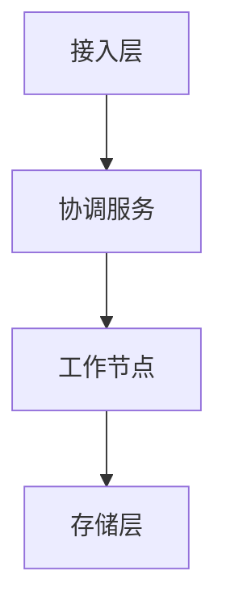

# 向量数据选型指南

## 背景

在当今数字化时代，非结构化数据（如文本、图像、音频等）的处理和分析变得越来越重要。这些数据通常需要通过嵌入技术（embedding）转化为高维向量，以便进行高效的相似性检索。向量数据库应运而生，它专门用于存储和检索向量数据，能够快速计算向量之间的相似性，从而支持各种应用场景，如推荐系统、图像识别、自然语言处理等。

## 概述

向量数据库是一种新型的数据库系统，它将数据以向量的形式存储，并提供高效的向量检索能力。与传统的关系型数据库不同，向量数据库专注于处理高维向量数据，能够快速计算向量之间的相似性，从而实现高效的检索和推荐。

## 作用

向量数据库在多个领域发挥着重要作用：

1. **推荐系统**：通过向量检索实现个性化推荐，提高用户体验。
2. **图像识别**：快速检索与目标图像相似的图像，提升识别效率。
3. **自然语言处理**：用于文本嵌入向量的检索，支持语义搜索和文本生成。
4. **多模态应用**：结合图像、文本等多种数据类型，实现跨模态检索。

## 底层技术

向量数据库的底层技术主要包括以下几个方面：

### 索引技术

1. **FLAT（Brute-force）**：最简单的检索算法，通过遍历所有向量计算距离，找到最近的向量。
2. **IVF（Inverted File）**：基于倒排索引的近似搜索算法，通过将向量分配到不同的子空间来加速检索。
3. **HNSW（Hierarchical Navigable Small World）**：一种基于图的近似最近邻搜索算法，通过构建多级图结构来提高检索效率。
4. **ANNOY（Approximate Nearest Neighbors Oh Yeah）**：基于树结构的近似最近邻搜索算法，适用于小规模数据。
5. **DISKANN（Disk-based Approximate Nearest Neighbors）**：基于磁盘的近似最近邻搜索算法，适合大规模数据。

### 存储技术

1. **内存存储**：将数据存储在内存中，以实现快速访问。
2. **磁盘存储**：将数据存储在磁盘上，支持大规模数据的持久化。
3. **分布式存储**：通过分布式架构将数据分片存储在多个节点上，支持水平扩展。

### 计算加速

1. **GPU加速**：利用GPU的强大计算能力，加速向量计算。
2. **并行计算**：通过多线程和分布式计算，提高向量检索的效率。

## 大模型与向量数据库

大模型（如Transformer架构的模型）通常会生成高维向量作为输出，这些向量可以用于各种下游任务，如文本生成、图像识别等。向量数据库在大模型的应用中扮演着重要角色，它能够高效地存储和检索这些向量，为大模型提供支持。

## 大模型开发

在大模型开发中，向量数据库可以帮助开发者快速实现以下功能：

1. **数据嵌入**：将非结构化数据嵌入到向量空间。
2. **向量检索**：快速检索与输入向量最相似的向量。
3. **生成增强**：结合检索结果生成更精准的内容。

## 向量数据库框架选型

以下是几种主流的向量数据库框架对比：

| 特性/框架          | Milvus                             | Faiss                         | Elasticsearch                    | Chroma                   |
| ------------------ | ---------------------------------- | ----------------------------- | -------------------------------- | ------------------------ |
| **开源协议**       | Apache 2.0                         | MIT                           | Apache 2.0                       | MIT                      |
| **存储与性能**     | 内存与持久存储结合，支持大规模数据 | 强调 GPU 加速，适合小规模数据 | 传统搜索引擎，支持文本和向量检索 | 轻量级，适合快速原型开发 |
| **数据处理与更新** | 自动数据分区和容错                 | 不支持数据更新                | 实时数据更新                     | 支持数据更新             |
| **搜索技术**       | 支持多种索引方法                   | 提供多种搜索算法              | 支持全文检索和向量检索           | 支持多种搜索算法         |
| **易用性**         | 提供 Python、Java 等多种语言 SDK   | 提供 Python 和 C++ 接口       | 提供丰富的 REST API              | 提供简洁的 API           |
| **适用场景**       | 推荐系统、图像搜索                 | 学术研究、小规模搜索          | 企业搜索、日志分析               | 快速原型开发             |

### Milvus 详细描述

Milvus 是一个专为处理大规模向量数据设计的开源向量数据库，具有以下特点：

#### 架构设计

Milvus 采用共享存储架构，遵循计算与存储分离的设计原则，整体分为四层：

1. **接入层**：无状态代理，负责请求验证和结果返回。
2. **协调服务**：负责任务分配、集群管理。
3. **工作节点**：执行具体的向量计算任务。
4. **存储层**：支持多种存储后端。

**架构图如下：**

<svg aria-roledescription="flowchart-v2" role="graphics-document document" viewBox="0 0 133 382" style="max-width: 133px;" class="flowchart" xmlns:xlink="http://www.w3.org/1999/xlink" xmlns="http://www.w3.org/2000/svg" width="100%" id="mermaid-0"><g><marker orient="auto" markerHeight="8" markerWidth="8" markerUnits="userSpaceOnUse" refY="5" refX="5" viewBox="0 0 10 10" class="marker flowchart-v2" id="mermaid-0_flowchart-v2-pointEnd"><path style="stroke-width: 1; stroke-dasharray: 1, 0;" class="arrowMarkerPath" d="M 0 0 L 10 5 L 0 10 z"></path></marker><marker orient="auto" markerHeight="8" markerWidth="8" markerUnits="userSpaceOnUse" refY="5" refX="4.5" viewBox="0 0 10 10" class="marker flowchart-v2" id="mermaid-0_flowchart-v2-pointStart"><path style="stroke-width: 1; stroke-dasharray: 1, 0;" class="arrowMarkerPath" d="M 0 5 L 10 10 L 10 0 z"></path></marker><marker orient="auto" markerHeight="11" markerWidth="11" markerUnits="userSpaceOnUse" refY="5" refX="11" viewBox="0 0 10 10" class="marker flowchart-v2" id="mermaid-0_flowchart-v2-circleEnd"><circle style="stroke-width: 1; stroke-dasharray: 1, 0;" class="arrowMarkerPath" r="5" cy="5" cx="5"></circle></marker><marker orient="auto" markerHeight="11" markerWidth="11" markerUnits="userSpaceOnUse" refY="5" refX="-1" viewBox="0 0 10 10" class="marker flowchart-v2" id="mermaid-0_flowchart-v2-circleStart"><circle style="stroke-width: 1; stroke-dasharray: 1, 0;" class="arrowMarkerPath" r="5" cy="5" cx="5"></circle></marker><marker orient="auto" markerHeight="11" markerWidth="11" markerUnits="userSpaceOnUse" refY="5.2" refX="12" viewBox="0 0 11 11" class="marker cross flowchart-v2" id="mermaid-0_flowchart-v2-crossEnd"><path style="stroke-width: 2; stroke-dasharray: 1, 0;" class="arrowMarkerPath" d="M 1,1 l 9,9 M 10,1 l -9,9"></path></marker><marker orient="auto" markerHeight="11" markerWidth="11" markerUnits="userSpaceOnUse" refY="5.2" refX="-1" viewBox="0 0 11 11" class="marker cross flowchart-v2" id="mermaid-0_flowchart-v2-crossStart"><path style="stroke-width: 2; stroke-dasharray: 1, 0;" class="arrowMarkerPath" d="M 1,1 l 9,9 M 10,1 l -9,9"></path></marker><g class="root"><g class="clusters"></g><g class="edgePaths"><path marker-end="url(#mermaid-0_flowchart-v2-pointEnd)" style="" class="edge-thickness-normal edge-pattern-solid edge-thickness-normal edge-pattern-solid flowchart-link" id="L_A_B_0" d="M66.5,62L66.5,66.167C66.5,70.333,66.5,78.667,66.5,86.333C66.5,94,66.5,101,66.5,104.5L66.5,108"></path><path marker-end="url(#mermaid-0_flowchart-v2-pointEnd)" style="" class="edge-thickness-normal edge-pattern-solid edge-thickness-normal edge-pattern-solid flowchart-link" id="L_B_C_1" d="M66.5,166L66.5,170.167C66.5,174.333,66.5,182.667,66.5,190.333C66.5,198,66.5,205,66.5,208.5L66.5,212"></path><path marker-end="url(#mermaid-0_flowchart-v2-pointEnd)" style="" class="edge-thickness-normal edge-pattern-solid edge-thickness-normal edge-pattern-solid flowchart-link" id="L_C_D_2" d="M66.5,270L66.5,274.167C66.5,278.333,66.5,286.667,66.5,294.333C66.5,302,66.5,309,66.5,312.5L66.5,316"></path></g><g class="edgeLabels"><g class="edgeLabel"><g transform="translate(0, 0)" class="label"><foreignObject height="0" width="0">

</foreignObject></g></g><g class="edgeLabel"><g transform="translate(0, 0)" class="label"><foreignObject height="0" width="0">

</foreignObject></g></g><g class="edgeLabel"><g transform="translate(0, 0)" class="label"><foreignObject height="0" width="0">

</foreignObject></g></g></g><g class="nodes"><g transform="translate(66.5, 35)" id="flowchart-A-24" class="node default"><rect height="54" width="102.75" y="-27" x="-51.375" style="" class="basic label-container"></rect><g transform="translate(-21.375, -12)" style="" class="label"><rect></rect><foreignObject height="24" width="42.75">

接入层

</foreignObject></g></g><g transform="translate(66.5, 139)" id="flowchart-B-25" class="node default"><rect height="54" width="117" y="-27" x="-58.5" style="" class="basic label-container"></rect><g transform="translate(-28.5, -12)" style="" class="label"><rect></rect><foreignObject height="24" width="57">

协调服务

</foreignObject></g></g><g transform="translate(66.5, 243)" id="flowchart-C-27" class="node default"><rect height="54" width="117" y="-27" x="-58.5" style="" class="basic label-container"></rect><g transform="translate(-28.5, -12)" style="" class="label"><rect></rect><foreignObject height="24" width="57">

工作节点

</foreignObject></g></g><g transform="translate(66.5, 347)" id="flowchart-D-29" class="node default"><rect height="54" width="102.75" y="-27" x="-51.375" style="" class="basic label-container"></rect><g transform="translate(-21.375, -12)" style="" class="label"><rect></rect><foreignObject height="24" width="42.75">

存储层

</foreignObject></g></g></g></g></g></svg>

#### 功能特性

1. **支持多种索引方法**：如 FLAT、IVF、HNSW 等。
2. **混合搜索**：结合向量和标量数据进行检索。
3. **多层数据组织**：支持 Database、Collection、Partition 等。
4. **高可用性和可扩展性**：支持分布式部署，水平扩展。

## 总结

选择合适的向量数据库需要综合考虑项目需求、性能要求和团队技术能力。Milvus 适用于处理大规模数据和高性能需求的场景，如推荐系统和图像搜索。Faiss 适合小规模数据和 GPU 加速的场景。Elasticsearch 适合需要综合搜索能力的场景。Chroma 则适合快速原型开发。